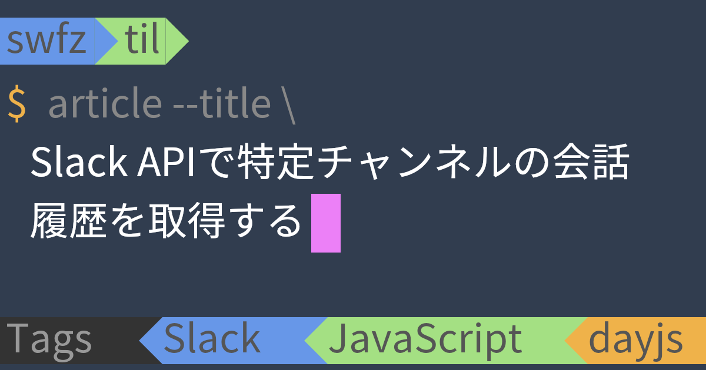

# deno-terminal-image

OGP Image builder

## url

example

```
https://terminal-image.deno.dev/?title=awesome_title&bottom_line_texts=tag1,tag2,tag3
```

### parameter

available GET url parameters

| key                     | description                                                                  | remark               |
| :---------------------- | :--------------------------------------------------------------------------- | :------------------- |
| title                   | article title                                                                | required             |
| top_line_texts          | Top StatusLine texts. separeted `,`                                          | e.g) hoge,fuga       |
| top_line_text_color     | Top StatusLine text color code, removed `#`                                  | e.g) 999999          |
| top_line_item_colors    | Top StatusLine background color codes by item, separeted `,`, removed `#`    | e.g) 999999,EFEFEF   |
| top_line_bg_text        | Top StatusLine background text                                               | e.g) Status          |
| top_line_bg_color       | Top StatusLine background color code, removed `#`                            | e.g) 333333          |
| bg_color                | Image background color code, removed `#`                                     |                      |
| prompt_color            | Prompt(`$`) color code, removed `#`                                          |                      |
| command_color           | Command(`article --title`) color code, removed `#`                           |                      |
| title_color             | Title color code, removed `#`                                                |                      |
| cursor_color            | Cursor color code, removed `#`                                               |                      |
| bottom_line_texts       | Bottom StatusLine texts, separeted `,`                                       | e.g) JavaScript,Deno |
| bottom_line_text_color  | Bottom StatusLine text color code, removed `#`                               | e.g) 999999          |
| bottom_line_item_colors | Bottom StatusLine background color codes by item, separeted `,`, removed `#` | e.g) 999999,EFEFEF   |
| bottom_line_bg_text     | Bottom StatusLine background text                                            | e.g) Tags            |
| bottom_line_bg_color    | Bottom StatusLine background color code, removed `#`                         | e.g) 999999          |

## URL Generator

If you want to create URLs or actually try things out, please use this URLGenerator.

[terminal-image.deno.dev/generator](https://terminal-image.deno.dev/generator)

## development

- run

```
deno run --allow-net --allow-read --allow-env --watch server.ts
```

- deploy

```
deno run --allow-net --allow-read --allow-env --allow-write  bundle.ts
deployctl deploy --project=til-ogp --prod server.ts
```

## sample


